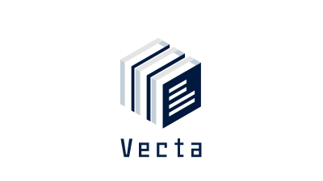

# vecta.co.jp-backend

Vectaのコーポレートサイトのバックエンド。

Cloudflare Workers で稼働します。

## 技術スタック

- **バックエンドフレームワーク**: [Honoフレームワーク](https://hono-ja.pages.dev/)

## 開発方法

### 必要条件

- Node.js 16.x 以上
- npm または Bun

### Get Started

リポジトリを `git clone` し、以下のコマンドを実行してください。

```shell
$ make bs
```

### 開発サーバーの起動

```bash
npm run dev
# または
bun run dev
```

開発サーバーが起動したら、ブラウザで [http://localhost:8787](http://localhost:8787) にアクセスしてください。

### デプロイ

```bash
npm run deploy
# または
bun run deploy
```

Cloudflare Workers にデプロイされます。

### テスト

```bash
npm run test
# または
bun run test
```

## ライセンス

All rights reserved © Vecta
