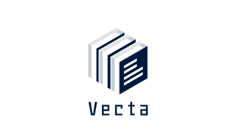

# vecta.co.jp-backend

Vectaのコーポレートサイトのバックエンド。

Cloudflare Workers で稼働します。

## アーキテクチャ

このリポジトリは、Cloudflareの3層アーキテクチャにおける**バックエンド層**として機能します。

フロントエンドのCloudflare Pages（vecta.co.jp）から、このCloudflare WorkersベースのバックエンドAPIを経由して、Cloudflare D1データベースにアクセスする構成となっています。この設計により、フロントエンドとデータベースを分離し、セキュアで拡張性の高いアプリケーションを実現しています。

### 各層の役割

1. **フロントエンド層** (Cloudflare Pages)
   - vecta.co.jpのWebサイト
   - 静的ファイルホスティング
   - Pages Functionsで軽量な処理

2. **バックエンド層** (このリポジトリ)
   - REST API (api.vecta.co.jp)
   - ビジネスロジックの実装
   - データベースアクセスの抽象化
   - 認証・認可の処理

3. **データベース層** (Cloudflare D1)
   - SQLiteベースのサーバーレスデータベース
   - エッジでの高速データアクセス

4. **スルー企業 Registry** (`vecta-ignored-company-registry`)
   - `vecta.co.jp` と `swarrow.com` で共通利用する企業ドメイン判定
   - 専用 D1 を source of truth とし、`IGNORED_COMPANY_REGISTRY` Service Binding 経由で照会
   - public route や browser secret を持たない非公開 Worker

## 技術スタック

- **バックエンドフレームワーク**: [Honoフレームワーク](https://hono-ja.pages.dev/)
- **API仕様**: OpenAPI ([Chanfana](https://github.com/cloudflare/chanfana) - HonoアプリケーションにOpenAPI仕様を追加するライブラリ)
- **データベース**: Cloudflare D1
- **認証**: APIキー認証、Cloudflare Access JWT 認証（詳細は[セキュリティ設定](docs/SECURITY.md)を参照）
- **メール送信**: SendGrid（詳細は[メール設定](docs/MAIL_SETUP.md)を参照）
- **企業スルー判定**: Cloudflare Workers Service Binding

## 開発方法

### 必要条件

- Node.js 16.x 以上
- Bun

### Get Started

リポジトリを `git clone` し、以下のコマンドを実行してください。

```shell
$ make bs
```

初回実行時は、開発環境用のAPIキーの入力を求められます。以下のコマンドで安全なAPIキーを生成できます：

```bash
# OpenSSLで32バイトのランダムキーを生成（推奨）
openssl rand -base64 32
```

### 開発サーバーの起動

先に `vecta-admin` リポジトリで Registry の local D1 と Worker を起動します。

```bash
cd ../vecta-admin
bun run registry:db:migrate:local
bun run registry:dev
```

別 terminal でこの backend を起動します。

```bash
bun run dev
```

開発サーバーが起動したら、ブラウザで [http://localhost:8787](http://localhost:8787) にアクセスしてください。

### 公開問い合わせフロー

`POST /contacts` は次の順序で処理します。

1. request validation
2. `IGNORED_COMPANY_REGISTRY` でメールドメインを照会
3. Cloudflare D1 へ保存
4. 未登録企業の場合だけ SendGrid で通知

登録済み企業は D1 に初期 `ignored` として保存し、通知メールを送信しません。公開 success response の status は通常受付と同じ `new` を返し、抑止対象であることをフォームへ開示しません。Registry を照会できない場合は、D1 保存・メール送信前に `503` を返して fail closed します。

### APIドキュメント

Swagger UIでAPIの仕様を確認できます：
- 開発環境: `http://localhost:8787/`
- 本番環境: `https://api.vecta.co.jp/`

### 管理リード API

`vecta-admin` は Cloudflare Access で保護された管理系 API から、問い合わせデータを共通 `Lead` contract として参照します。

| Endpoint | 用途 | 認証 |
| --- | --- | --- |
| `GET /admin/leads` | `vecta.co.jp` 由来の問い合わせ一覧を `Lead[]` として取得 | Cloudflare Access JWT |
| `GET /admin/leads/:leadId` | 問い合わせ1件を `Lead` として取得 | Cloudflare Access JWT |
| `PATCH /admin/leads/:leadId/status` | 問い合わせの対応ステータスを更新し、更新後の `Lead` を取得 | Cloudflare Access JWT |

`PATCH /admin/leads/:leadId/status` の request body は次の形式です。

```json
{
  "status": "ignored"
}
```

更新で指定できる admin status は `new` / `reviewing` / `closed` / `ignored` です。DB の `contacts.status` にはそれぞれ `new` / `in_progress` / `completed` / `ignored` として保存します。既存の `contacts.status` は `TEXT` で CHECK 制約がないため、`ignored` 追加のための migration は不要です。

管理系 API では `Cf-Access-Jwt-Assertion` を検証します。production では `ACCESS_TEAM_DOMAIN`、`ACCESS_POLICY_AUD`、`ADMIN_CORS_ALLOWED_ORIGINS` を deployment 環境変数または Worker secret として設定してください。`ACCESS_JWKS_URL` は検証用 JWKS endpoint を明示したい場合のみ使います。

### データベース

#### D1データベースの環境

- **ローカル環境 (`--local`)**: 開発マシン上のSQLiteデータベース（`.wrangler/state/`に保存）
- **リモート環境 (`--remote`)**: Cloudflareエッジ上の本番D1データベース

#### マイグレーション

```bash
# ローカルDBの初期化
bun run db:migrate:local

# 本番DBの初期化（Cloudflareログインが必要）
bun run db:migrate:remote

# ローカルDBのリセット（開発時のみ）
bun run db:reset:local
```

#### ローカルデータベースの確認方法

```bash
# テーブル一覧
bun wrangler d1 execute DB --local --command "SELECT name FROM sqlite_master WHERE type='table';"

# テーブル構造の確認
bun wrangler d1 execute DB --local --command "PRAGMA table_info(contacts);"

# データの確認
bun wrangler d1 execute DB --local --command "SELECT * FROM contacts;"

# SQLiteクライアントで直接確認（ファイルパスは環境により異なる）
sqlite3 .wrangler/state/v3/d1/miniflare-D1DatabaseObject/*.sqlite
```

### デプロイ

`vecta-admin` が所有する Registry D1 migration と `vecta-ignored-company-registry` Worker を先に deploy してください。Service Binding の target が利用可能になってから、この backend を deploy します。

このリポジトリはCloudflareと連携しているため、mainブランチへのプッシュで自動的にデプロイされます。

手動でデプロイする場合：
```bash
bun run deploy
```

### テスト

```bash
bun run test
```

## ライセンス

All rights reserved © Vecta
